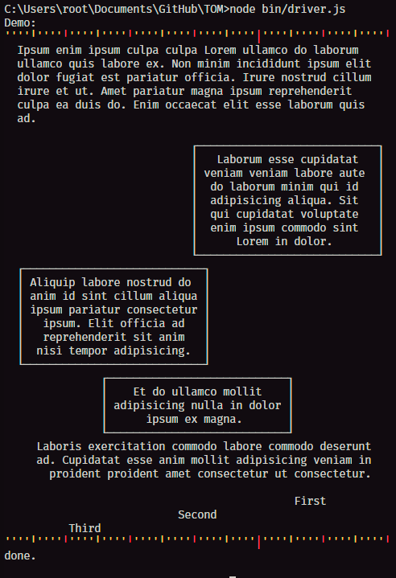

= Terminal document Model Object

The Terminal document Model Object (TOM) is an experiment to get `html` and `css` _like_ output for the terminal, or other plaintext streams.

.Example output of the library

== Version #1

- Supports a raw `Element` class that contains text content.
- Supports the following `inline properties`:
width:: { `ch`, `%`, `\?` }
margin:: { `ch`, `auto` }
padding:: { `ch`'}
border:: { `solid` }
text-align:: { `left`, `center`, `right` }