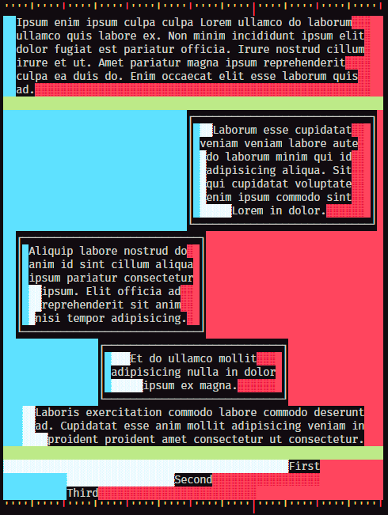

= Terminal document Model Object

The Terminal document Model Object (TOM) is an experiment to get `html` and `css` _like_ output for the terminal, or other plaintext streams.

.Example output of the library
image::resources/example1.png[]

== Version #1

.Features

- Long lines are wrapped to fit within the Element.
- Lines can be justified within the element: right, center, or left justification.
- Borders can be added to elements
- Both `padding` and `margin` can be set per element.
- Properties are inherited from parent elements
- `margin: 'auto'` can be used to center fixed sized element within the document.
- `width: new Percent(50)` will calculate the element width based on the parent's width.

.Supported `inline properties`:

[horizontal]
width:: { `ch`, `%`, `?` }
margin:: { `ch`, `auto` }
padding:: { `ch` }
border:: { `solid` }
text-align:: { `left`, `center`, `right` }

[horizontal, small]
`ch`:: character absolute units
`%`:: percent relative units
`?`:: inherited units

== Debugging

Version 1 supports a `debug` flag for rendering the padding and alignment characters with `ansi escape-sequence` colours.

